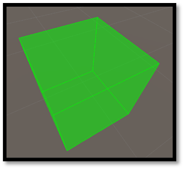

# How to Get Started with DrawBug
This tutorial teaches you the basics of getting started with DrawBug.
- - -
## Drawing Shapes
Let's start by drawing a cube in the center of the scene.

Create a new C# script in Unity and write the following code:
[!code-csharp]

In your Unity scene, create a new object and add the script to it. When you hit `Play` you should see a cube in the
scene:

To position the cube in the object's position, orientation, and scale, write the following code:
[!code-csharp]

Now you should be able to manipulate the cube by changing the object's transform.

## Changing the style
You can customize the way DrawBug draws your objects.
Let's start by drawing a red cylinder:
[!code-csharp]

DrawBug accepts a DrawingStyle to draw its shapes, but what we did was pass a Color.red, because DrawBug implicitly converts it to a DrawingStyle.
The equivalent of our code above would be:
[!code-csharp]
Resulting in the same red cylinder.

### Available styles
The available styles are:

#### Color WireColor: (color to be used when drawing lines)
Example:
[!code-csharp]

> This code won't draw anything; this is because when not using implicit converters, you need to specify which method to use for drawing, such as "wire" for example:

[!code-csharp]

#### Color SolidColor: (color to be used when drawing solid shapes)
[!code-csharp]

#### DrawMethod DrawMethod: (Specifies the way DrawBug will render its shapes)

##### • Wire
[!code-csharp]

##### • Solid
[!code-csharp]

##### • Both
[!code-csharp]

## Using DrawPhysics
Casts in Unity can be confusing to understand and debug. DrawBug can simplify this by adding bounding shapes to
check for collisions. Just replace Physics.(...) with DrawPhysics.(...).

#### Unity's default:
[!code-csharp]

#### Using DrawPhysics:
[!code-csharp]